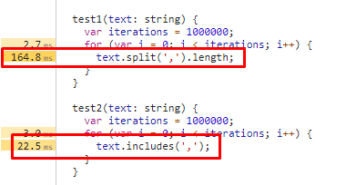

# Coding challenge

For this project I have used:
- Angular 12
- Angular Material
- SCSS
- ESLint
- Prettier

I tried to do everything typed, as it makes the application more robust and easier to maintain.

I also like to know what to expect as a return from a function, for instance, and therefore always try to type everything possible.

## Routing

I always do the Angular applications with routing since it may become a larger application in a future. Furthermore, to solve the problem of accessing not defined URLs, for me routing was the easiest approach since I always solve it this way: 
```ts
{ path: '**', redirectTo: '/', pathMatch: 'full' }
```

## Pipes

It was not a requirement to show the full country name, however I wanted to integrate a pipe on the practice and I found this the cleanest way to do so.

`CountryNamePipe` transforms a country name abbreviation to its full name.

I also used the Angular `DatePipe` to show the selected date.

## `Input/Output` vs `Subject/Subscribe`

I have been coding Angular for the last 3.5 years. Yet still, for most of this time, I have been using Angular `Input` and `Output` for communication between components.

Now, however, I am trying to transition to a more centralized states solutions.

I know about NgRx, but my knowledge about it is too limited to use it for now.

Because of the mentioned above, I decided to implement a bit of each in this practice, to show both knowledge.

I used some `Input` for some components, while using `RxJS` for others.

The reason for me to transition from `Input` to a state solution, is because `Input` and `Output`, on big scale applications with quite a large tree of component dependencies, is tedious, not easy to read nor mantain, escalates the difficulty of the project, and it even introduces bugs.

For instance, imagine you have a component. Now this component has a child component, which requires an input from the parent, and the parent updates some variable both through his own logic, and through the child component's output.

Now add a child to the child, that acts samewise as the parent. Now a child to the child of the child.

Now you have to apply logic to the component, the child, the grandchild, and the great-grandchild. Not only that, but the output from the great-grandchild has to be emitted all the way up to the original one, while each component implements it's logic.

The deeper you go, the harder it gets. However, if you instead of following an `Input/Output` approach, decide to go for an `Observable` one, it is way easier in my opinion. Plus no delays from the render of the DOM.

This is the functionallity of the `StateService`.

### `Input` setter and getter

I implemented this approach on `ResultsComponent`.

I did so because I wanted to change other things from the component when this input is changed. Using `Input/Ouput` this is the most reliable way I have found yet.

## Show icon function

As required on the document, I made it the most efficient way I could think of.

As commented on the function, at first I was going for the easy route to make sure it simply worked, which was `.split(',').length > 0`.

Then, when everything was working, I decided to focus on making it efficient.

The solution I came up with was, intuitively, the simplest one, so I was not sure it would be actually faster. Simply check if there is a comma with `.includes(',')`, so I did some benchmarks.

Using the Chrome debugging tools, under the performance tab, you can record the time it takes for almost anything.

So I created two testing functions that did the above a lot of times, to see which one is faster.

This were the results:



As you can see, `includes` is about x7.5 times faster.

The reason is kind of obvious once you think about it. Whereas `includes` simply goes char by char checking if that one matches and when it matches, it stops, `split` has to read all the string and search for the comma. It also has to create and deal with the array. Not only that, it also has to check the length of it, accessing the object once again.


## Structure

I have used a similar one to the one I use at work. The structure I use at work is a bit more complex/extended, but since here the application was basic, I decided to try with this one.

It is a little more unorganized, but ironically is also easier to navigate through.

The structure to generate components would be as it follows:
```
- app
  - components
    - <component_name>
      - <component_name>.component.ts
      - <component_name>.component.html
      - <component_name>.component.scss
      - <component_name>.module.ts
      - <if subcomponents> components
        - <subcomponent_name>.component.ts
        - <subcomponent_name>.component.html
        - <subcomponent_name>.component.scss
        - <subcomponent_name>.module.ts
    <...>
  - shared
    - models
      - <model_name>.model.ts
      <...>
    - services
      - <service_name>.service.ts
      <...>
    - pipes
      - <pipes_name>.pipe.ts
      <...>
    - components
      - <component_name>
        <...>
```

I can further explain it on the interview.

## SCSS

I was not able to do much with it since I focused rather on the functionallity of the application.

Still, there are some (very few) things done with it.

## Angular Material

I have used this component library since it is, in my opinion, the most well done for Angular.

It may not have some components, but the ones they have are robust.

I have used it for:
- Icons
- Datepicker (calendar)
- Cards (styling)
- Spinner (styling)
- Divider (styling)

I think they also look minimalistic while modern and pleasing to the eye without having to change anything, which internally means you do not have worry too much about styling once you are finished.

## Linting

For this I simply used ESLint with Angular, since it is an easy integration.

I have also used Prettier since I have worked with it since I started programming with Angular, and works quite well in my opinion.

## Testing

In the company I have and am working for, we do not do testing because of client requiements, so this was new for me.

I usually do not do testing neither for my own personal projects since I do them for myself to make some process more agile.

I tried to do a high coverage testing with the knowledge I have since I have done some courses about it, but I am uncertain to have done them properly.

My objective was to not only have a high code coverage while making sure the tests are written correctly and are useful.


## `Public` / `Private`

I usually make everything private if possible, even though it is sugar syntax.

I still think it makes the code cleaner, since you know this variable or function is not meant to be used outside of the scope nor on the HTML.

However, to be able to test almost everything, I had to make some of them public.

## Comments

Since I was a bit in a hurry for this project, I did not write down many comments.

I usually develop the solution I have analyzed, and before committing and pushing, I write down the comments explaining everything.

In this case however, I preffered to write this README.
## Other

I had some ideas about this project that I wanted to implement. I was able to do some, but had others that I couldn't finish up.

### Proxy

Since I was having trouble with CORS because of using differents domains for API and frontend, I had to use a proxy configuration for the development environment.

The file used is called `proxy.conf.json`, and can be found in the root of the project.

### TypeScript Configuration

The file `tsconfig.json` has the configuration for the TypeScript on this project.

Inside `compilerOptions`, I added:
```json
"paths": {
  "@shared/*": ["./src/app/shared/*"]
}
```

What this does is to make URLs cleaner. No need for barrels, and no more `../../../shared/<etc>`. The path, no matter where the file is, will now be `@shared/<etc>`.

### GitHub Actions

Since I like DevOps and I am quite interested on it, in my free time and with my projects, I usually try to integrate some basic CI/CD pipelines so the code not only gets tested (in my case linted), but also build and deployed automatically.

In this case, I made two different actions.
- One is activated when creating a PR towards `master`. This checks linting and testing.
- The other one is activated when a commit is made on `master`. It only executes the build command.

This is because of my way of organizing branches. On a real project, I would have, at least, `master`, `test` and `develop`.

Coding would be done on branches that emerge from `develop`, and then a PR would be submitted back to it.

Once the code is done, it goes to `test`, which represents the test environment.

If no errors are found, it goes to `master`, which would also be known as Production.

If an error emerges from `master`, a `hotfix` branch would emerge from it, and then a PR would be made back to `master` and also `develop`.

This way no commits are made on `master` except the completed PRs.

[The actions past runs can be found here](https://github.com/Gummiees/name-calendar/actions).

[I have also added releases to GitHub](https://github.com/Gummiees/name-calendar/releases).

### Firebase

I wanted to host the website on Firebase. However, some problems appeared:
  - I wasn't able to make the API calls to the REST service because of CORS.
  - I am no expert on this topic, therefore I investigated a little on it.
  - After some time without any working results, I decided to leave it there since this practice has to be done under certain time and this is not a requirement neither a sugestion, I was simply doing it so it would be easier to share.

On other projects, I was able to successfully host Angular sites on Firebase, same as with this one, even with a GitHub action associated to it. However, because of CORS, I was not able to have a production version which was able to retrieve information from the API.

### Styling

I know it clearly says it will not be taking into consideration, but still I wanted to so something somewhat pretty. It is also mobile-friendly.

### Commits

The commits descriptions are obviously not well made and in a hurry. Again, in a real environment I would describe the changes that were made and, if necessary, also the reason to make them in the first place.

Here, however, since I thought I could be running out of time, I decided to rather not have time to do proper commit messages than to omit some functionallity.
